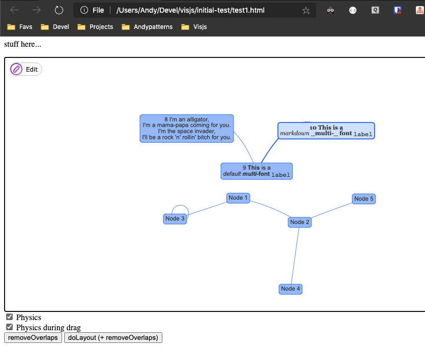
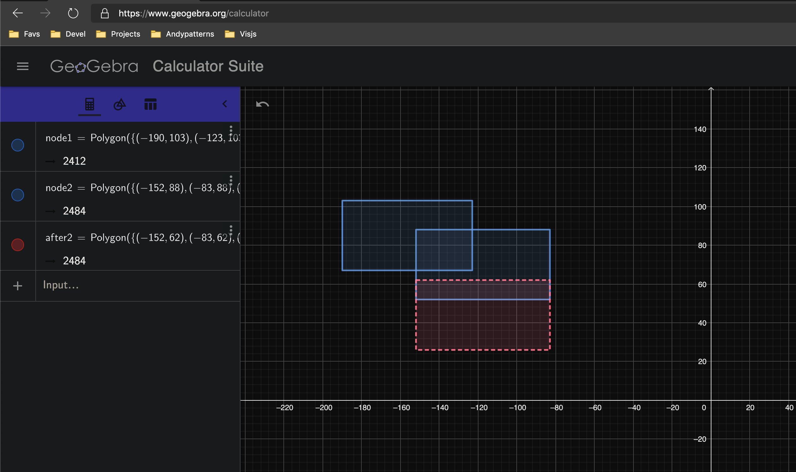

# Overlaps removal server - with visjs client example

Exposes the Pynsource Overlap Remover as a server API.

When I developed Pynsource the layout algorithm I used was a standard network
spring layout which takes no account of the size of nodes. It assumes nodes
are all the same size - a pretty cheap, lazy assumption IMO - but ok for
a lot of use cases.

Thus you often get overlaps after running a layout e.g. two bigger nodes will
overlap in reality once rendered, even though the underlying layout algorithm
doesn't think there is an overlap or a problem.

So I introduced my own overlap removal phase, to be run after the layout phase
which would remove those overlaps by nudging various nodes around. This is used
in Pynsource, and now exposed as a server for use by anyone. The client example 
here is for a visjs javascript network layout - which is open source and very 
cute and powerful.

Note that both visjs and my pynsource graph object assume a "screen" coordinate
system where Y increments south 
                                                            
                  ┌────┐        
                  │ -y │        
                  └────┘        
                    │           
                    │           
         ┌────┐     │     ┌────┐
         │ -x │ ────┼───▶ │ +x │
         └────┘     │     └────┘
                    │           
                    ▼           
                  ┌────┐        
                  │ +y │        
                  └────┘        

as opposed to a traditional math cartesian coordinate system which y increments north.

## Screenshots






## Installation

The server uses Pynsource python code, so install its requirements.

The client is a HTML app and uses visjs taken a cdn so no installation required.

## Running the server

    python -m flask run --no-reload flask_main.py

## Running the client

Simply open this HTML file in your browser

    client_example/index.html

# API Notes

Send up JSON get back JSON.

JSON we send up is a list of nodes and edges. 
See Research/overlap_removal_server/payload1.js 

Example of usage:

POST to http://127.0.0.1:5000/overlaps

```javascript
{
    nodes: [
        { id: "a", label: "A", left: 0, top: 0, width: 250, height: 250 },
        { id: "a1", label: "A1", left: 0, top: 0 },
        { id: "a2", label: "A2", left: 0, top: 0 }
    ],
    edges: [
        { from: "a", to: "a1" },
        { from: "a", to: "a2" },
    ]
}
```

which as proper JSON is:

```json
{"nodes":[{"id":"a","label":"A","left":0,"top":0,"width":250,"height":250},{"id":"a1","label":"A1","left":0,"top":0},{"id":"a2","label":"A2","left":0,"top":0}],"edges":[{"from":"a","to":"a1"},{"from":"a","to":"a2"}]}
```

Response contains the modified graph of nodes and edges with new left, top positions
as well as some metadata e.g. JSON

```json

            {
            "error": "none", 
            "graph": {
                "edges": [
                {
                    "from": "a", 
                    "to": "a1"
                }, 
                {
                    "from": "a", 
                    "to": "a2"
                }
                ], 
                "nodes": [
                {
                    "height": 60, 
                    "id": "a", 
                    "left": 0, 
                    "top": 0, 
                    "width": 60
                }, 
                {
                    "height": 60, 
                    "id": "a1", 
                    "left": 65, 
                    "top": 0, 
                    "width": 60
                }, 
                {
                    "height": 60, 
                    "id": "a2", 
                    "left": 130, 
                    "top": 0, 
                    "width": 60
                }
                ]
            }, 
            "graph_as_string": "# PynSource Version 1.2\n{'type':'meta', 'info1':'Lorem ipsum dolor sit amet, consectetur adipiscing elit is latin. Comments are saved.'}\n{'type':'', 'id':'a', 'x':0, 'y':0, 'width':60, 'height':60}\n{'type':'', 'id':'a1', 'x':65, 'y':0, 'width':60, 'height':60}\n{'type':'', 'id':'a2', 'x':130, 'y':0, 'width':60, 'height':60}\n{'type':'', 'id':'a_to_a1', 'source':'a', 'target':'a1'}\n{'type':'', 'id':'a_to_a2', 'source':'a', 'target':'a2'}\n", 
            "total_contractive_moves": 0, 
            "total_cycles": 4, 
            "total_expansive_moves": 3, 
            "total_overlaps_found": 5, 
            "total_postmove_fixes": 0, 
            "warning_msg": "", 
            "were_all_overlaps_removed": true
            }
```

## Test (postman)

```javascript
pm.test("Status code is 200", function () { pm.response.to.have.status(200); });
pm.test("all overlaps removed", function () { 
    pm.response.to.have.status(200); 
    
    // check actual json payload, convert to dict
    var jsonData = JSON.parse(responseBody);
    
    pm.expect(jsonData.error).to.equal('none');
    pm.expect(_.get(jsonData, 'error')).to.equal('none');

    // ensure all overlaps were removed    
    pm.expect(jsonData.were_all_overlaps_removed).to.equal(true);

    // check specific values    
    let a = _.findNode('a', jsonData);
    pm.expect(a).to.have.property('height');
    pm.expect(a.left).to.equal(0);
    pm.expect(a.top).to.equal(0);
    
    pm.expect(_.findNode('a1', jsonData).left).to.equal(65);
});
```

### Postman tip:

Put common shared scripts in the collection pre-request scripts, 
which is trickily accessed via the collections ... button then Edit / Pre-request Scripts.

Define them on Object and then it will be available on any object including underscore _ object
https://stackoverflow.com/questions/45673961/how-to-write-global-functions-in-postman 

```javascript
Object.prototype.sayHello = function(name){
    console.log(`Hello! ${name}`);
};

Object.prototype.findNode = function(id, jsonData) {
    if (id === undefined) {
        console.log('id is undefined');
        return;
    }
    for (let node of jsonData.graph.nodes)
        if (node.id == id)
            return node;
    return undefined;
};
```
